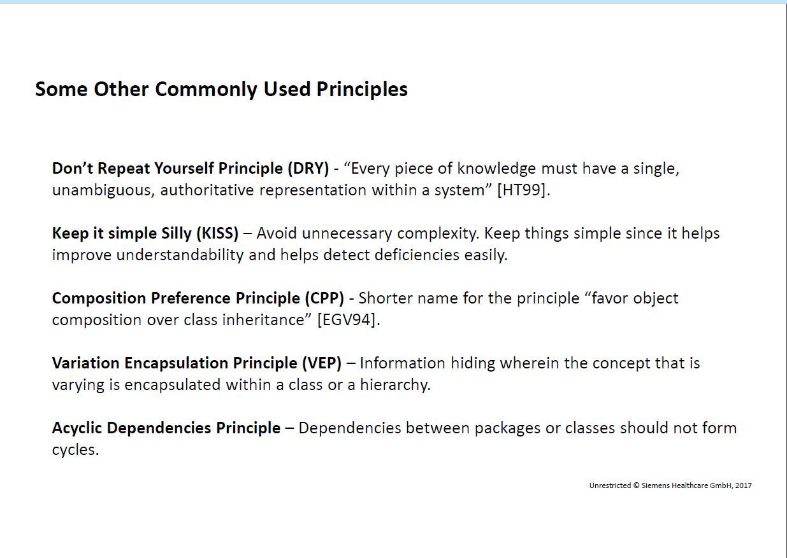

- [Advance Focus Design](#advance-focus-design)
  - [Design Principles](#design-principles)
    - [Single Responsibility Principle](#single-responsibility-principle)
    - [Open-Close Principle](#open-close-principle)
    - [Liskov's Substitution Principle](#liskovs-substitution-principle)
    - [Interface Segregation Principle](#interface-segregation-principle)
    - [Dependency Inversion Principle](#dependency-inversion-principle)
  - [Design Quality](#design-quality)

[ASP.NET Core 6, Design Pattern Guide Book](ASP_NET_CORE_DesignPattern_Guide.md)

# Advance Focus Design

## Design Principles
Design principles are universally applicable concrete design rules to guide a developer,
designer, or architect during design conceptualization or maintenance phases.

### Single Responsibility Principle
- There should never be more than one reason for a class to change
- A responsibility is a “reason for change”
- Concentrate on a single aspect in an abstraction

### Open-Close Principle
- Software entities should be open for extension and closed for modification
  - Open for extension – extend with new behaviors
  - Closed for modification – extending behavior does not result in changes to the
existing source code or binary code of module. .exe, DLL, .jar remain untouched!
  
### Liskov's Substitution Principle
- Clients that use references (or pointers) to base abstractions must be able to use their
derived abstractions without knowing it
- A subclass must be replaceable where its super class is referenced
- Everything that is true of the base type should be true of the subtype

### Interface Segregation Principle
- Clients should not be forced to depend upon interfaces that they do not need
- When a client A depends on a class that contains methods that it does not use, but
which other clients use, client A will be affected by changes those other clients
force upon the class

### Dependency Inversion Principle
- Abstractions should not depend upon implementation details. Details should be dependent upon
abstractions.
- High-level abstractions should not depend on low-level abstractions
-  Clients should depend on interfaces not implementation (loose coupling)

## Design Quality
? Software 